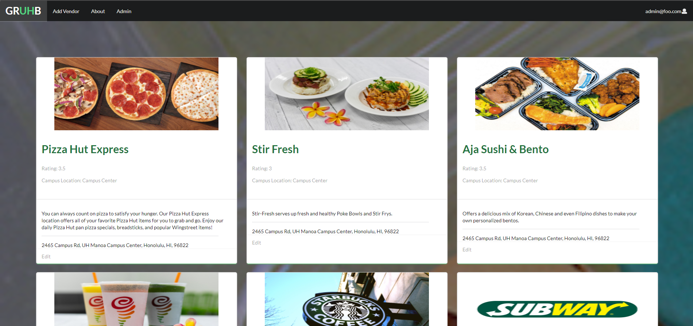

Three people in a team. The project was simple. Create an app with a friendly interface for finding vendors across the campus built for students new to a University. The app could be used for any university, but as a starting point we would go on to create it for our home university(UHM) as an ICS 314 project. The project was named GrUHb with clever wordplay for our college at UHM.[The website is up and running here.](https://gruhb.xyz/#/)

In this project I was in charge of UI Elements with some data gathering. At first the ideas were overflowing a bit too much. We had ideas like a modernized automated slideshow that would go through food pages of vendors in the database, an interactive map with the current position of all vendors which change throughout the week, and much more complicated things that we couldn't solve with our current libraries. But we settled on simple goals to downplay the expectation and focus on getting the functionality done first. Although an ambitious project was good, being too ambitious would lead to our downfall especially since none of us had ever experienced working like this before.

It was actually going extremely smooth. I created a few components and changed the design to make it more modern. However, it all changed when I encountered issues that the system wasn't built for. The first problem was having a simple online form be able to put info in an array schema variable within a schema array(2-Dimenisional Array). After about a week of researching, funneling through pages, and testing code, it was literally impossible with our current knowledge to overcome it. This was especially a problem since the library we used to create the online form only supported a simple(1-Dimensional) array which means all variables in a schema must not have another array in them. There were many attempts to fix this mold, but all ended in failure.

The same happened with an attempt to create a search bar

Originally above the Squares that hold the vendor information, we had a search bar. But due to certain quirks in React jsx that Regular js doesn't have, we were running into all types of issues, and just when we fixed one adbout 2-3 would form out of nowhere. This created an endless timesink loop of fixes and more bugs that became unbearable after a week into it's initial development. Throughout all these bugs and errors, it really was the most fustrating thing to get happy over a possible fix just to have your hope shattered over and over again, but it really helped to build up experience on what was possible and not possible. To me it highlighted the importance of underestimating yourself to get a cleared view on the imposibilities and realistic expectations.

Teamwork wasn't that massive of a shock to the rythm of progress because of project boards that would show the issues needed to be solve, especially since we meeted to discuss the latest issues often. To be fair it was great progress for a ragtag team with about 10 other exams to study for at the time and if you want to see the full details of the project [click here.](https://gruhb-doc.github.io/) 
